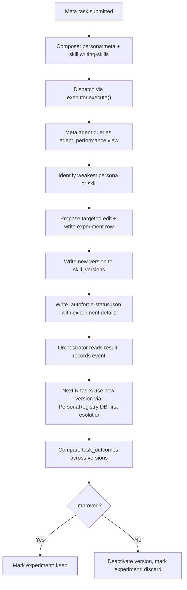

# Self-Improving Agent Pipeline

## Design Principles

1. **Composition**: Every agent — planner, coder, reviewer, doc, meta — is composed the same way: `persona(type) + skills(type) + task_context`, resolved through `PersonaRegistry` and `SkillRegistry`, dispatched through `AgentExecutor`. No special paths.

2. **Event-driven, minimum overhead**: Agents communicate through `.autoforge-status.json`. The orchestrator records events to SQLite. Self-improvement reads from those same events — no new communication channels.

3. **Simplicity**: Each layer below is independently useful and testable. Defer doc freshness tracking, context provenance, QMD expansion, and routing calibration until the core improvement loop proves itself.

4. **Unified prompt asset model (Option A)**: Personas and skills are both versioned text in `skill_versions`, distinguished by naming convention (`persona:coder`, `skill:tdd`). One improvement loop handles both.

---

## Layer 1: Fix the Executor Gap

**Problem**: `ClaudeCodeExecutor.buildPrompt()` in [src/executors/claude-code.ts](src/executors/claude-code.ts) ignores `task.systemPrompt` — it only includes skills + task + status. With `EXECUTOR_DEFAULT=claude-code`, personas are silently dropped. The `AnthropicSdkExecutor` correctly uses `task.systemPrompt` as the first section of the system prompt.

**Change**: In `buildPrompt`, prepend `task.systemPrompt` (the persona) before skills, matching the SDK executor's behavior:

```typescript
function buildPrompt(task: AgentTask): string {
  const sections: string[] = [];
  sections.push(task.systemPrompt);          // persona — was missing
  const skillContents = loadSkillFiles(task.skillFiles);
  if (skillContents) sections.push(`# Skills\n\n${skillContents}`);
  sections.push(`# Task\n\n${task.prompt}`);
  sections.push(STATUS_REPORTING_BLOCK);
  return sections.join("\n\n");
}
```

**Files**: [src/executors/claude-code.ts](src/executors/claude-code.ts)

**Test**: Run a task with `EXECUTOR_DEFAULT=claude-code`, verify the persona text appears in the prompt piped to stdin (add a debug log temporarily, or inspect the agent's behavior for persona-specific instructions).

---

## Layer 2: Wire Outcome Metrics into Events

**Problem**: `AgentResult.metrics` contains `tokenInput`, `tokenOutput`, `estimatedCost` from the Anthropic API, but `recordEvent` in [src/orchestrator/service.ts](src/orchestrator/service.ts) never passes them through. The `appendEvent` method in [src/db/client.ts](src/db/client.ts) already reads `message.tokenUsage` and writes to the existing columns — the gap is a missing assignment in the orchestrator.

**Changes**:

- Add `tokenUsage` and `executorUsed` fields to the `recordEvent` input type
- After every `executor.execute()` call (planner, coder, reviewer, doc), pass `result.metrics` and `this.deps.executor.name` into `recordEvent`
- After `runTests`, emit a `test_results` event with `passRate` in the payload (currently consumed by `evaluatePrGate` and discarded)

**Files**: [src/orchestrator/service.ts](src/orchestrator/service.ts)

**Test**: Run a task, query `SELECT token_input, token_output, estimated_cost, executor_used FROM events WHERE agent != 'orchestrator'` — all non-null.

---

## Layer 3: Provenance Tracking

**Problem**: When a coder runs, we don't record which persona version or skill versions were active. Later, you can't answer "did changing persona:coder improve outcomes?" because you don't know which version was used for which task.

**Design**: Two additions to the orchestrator's dispatch flow.

### a) Snapshot on dispatch

Add a method to `PersonaRegistry` (or a shared helper):

```typescript
snapshotId(agentType: AgentType): string
```

Returns the `skill_versions.id` of the active persona row, or computes a content hash from the file on disk and upserts into `skill_versions` if not already present. Same pattern for skills via `SkillRegistry`.

### b) Record in event payload

Every executor-related event includes:

```json
{
  "persona_version_id": "abc123",
  "skill_version_ids": ["def456", "ghi789"],
  "agent_type": "coder"
}
```

This uses the existing `skill_versions` table — no schema changes needed. The `skill_versions` rows that represent file-on-disk content get created lazily on first use, with `experiment_id = NULL` (seed version, not from an experiment).

**Files**: [src/personas/registry.ts](src/personas/registry.ts), [src/skills/registry.ts](src/skills/registry.ts), [src/orchestrator/service.ts](src/orchestrator/service.ts), [src/db/client.ts](src/db/client.ts) (upsert-by-hash method)

**Test**: Run a task, query `SELECT id, skill_name, is_active FROM skill_versions` — see `persona:planner`, `persona:coder`, `persona:reviewer`, `skill:tdd`, etc. Query events — payloads contain version IDs.

---

## Layer 4: Outcome Views

**Problem**: Quality signals are scattered across events, findings, and transient variables. Answering "which persona version performs best?" requires manual joins.

**Design**: Two SQL views in [src/db/schema.sql](src/db/schema.sql). No TypeScript changes.

### task_outcomes

Aggregates per-task signals from events and findings:

```sql
CREATE VIEW IF NOT EXISTS task_outcomes AS
SELECT
  t.id AS task_id, t.project_id, t.tier,
  t.state AS final_state, t.iteration AS iterations,
  SUM(e.token_input) AS total_tokens_in,
  SUM(e.token_output) AS total_tokens_out,
  SUM(e.estimated_cost) AS total_cost,
  SUM(e.elapsed_seconds) AS total_elapsed,
  (SELECT COUNT(*) FROM review_findings rf WHERE rf.task_id = t.id) AS finding_count,
  (SELECT COUNT(*) FROM review_findings rf WHERE rf.task_id = t.id AND rf.severity IN ('CRITICAL','MAJOR')) AS blocking_finding_count,
  CASE WHEN t.iteration = 0 AND t.state = 'completed' THEN 1 ELSE 0 END AS first_pass_success,
  t.created_at
FROM tasks t
LEFT JOIN events e ON e.task_id = t.id AND e.agent != 'orchestrator'
WHERE t.state IN ('completed', 'failed')
GROUP BY t.id;
```

### agent_performance

Aggregates outcomes by persona/skill version:

```sql
CREATE VIEW IF NOT EXISTS agent_performance AS
SELECT
  json_extract(e.payload, '$.persona_version_id') AS persona_version_id,
  e.agent AS agent_type,
  COUNT(DISTINCT t.id) AS task_count,
  AVG(CASE WHEN t.iteration = 0 AND t.state = 'completed' THEN 1.0 ELSE 0.0 END) AS first_pass_rate,
  AVG(t.iteration) AS avg_iterations,
  AVG(e.estimated_cost) AS avg_step_cost
FROM events e
JOIN tasks t ON t.id = e.task_id
WHERE e.agent IN ('planner','coder','reviewer','doc')
  AND t.state IN ('completed','failed')
  AND json_extract(e.payload, '$.persona_version_id') IS NOT NULL
GROUP BY persona_version_id, e.agent;
```

**Test**: After running 3+ tasks, `SELECT * FROM agent_performance` returns meaningful rows grouped by persona version.

---

## Layer 5: Meta Agent Loop (Design Sketch)

The meta agent is composed like any other agent: `persona:meta` + `skill:writing-skills` + task context (outcome data). It's dispatched through the same executor and communicates through the same `.autoforge-status.json` convention.

### Trigger

Submitted via web UI or scheduled: `POST /api/tasks` with a meta-task description like "Analyze coder performance and propose persona improvement."

### Flow



### Key details

- The meta agent reads outcome data by querying SQLite (via the `bash` tool) or by receiving a pre-formatted summary in its prompt
- It writes proposed changes to `skill_versions` via `write_file` to a staging area, or the orchestrator applies the change after reading `.autoforge-status.json`
- The `experiments` table tracks hypothesis, `metric_before`, `metric_after`, and `status` (proposed/active/keep/discard)
- `PersonaRegistry.resolve()` already picks DB rows with `is_active = 1` — the meta agent just needs to insert a new row and set the old one to `is_active = 0`
- Canary: run N tasks, then compare `task_outcomes` for the old vs new `persona_version_id`

### What the meta agent needs access to

- The `bash` tool (already available in both executors) to query SQLite directly
- The working directory with the `skill_versions` data (or a pre-formatted report in the prompt)
- Write access to propose changes (via `.autoforge-status.json` output that the orchestrator interprets)

### Implementation note

The meta agent orchestration path (how the orchestrator handles `type: "meta"` differently from normal tasks) is the main new code. Normal tasks go through plan → code → review → test → PR. A meta task goes through analyze → propose → activate → measure → decide. This is a **separate orchestrator method** (e.g., `submitMetaTask`), but it uses the same `executor.execute()` dispatch.

---

## Implementation Sequence

| Order | Layer | Effort | Independently useful? |
|-------|-------|--------|-----------------------|
| 1 | Fix claude-code executor gap | Small (one function edit) | Yes — personas work with both executors |
| 2 | Wire outcome metrics | Small (pass-through in service.ts) | Yes — cost/token visibility in events |
| 3 | Provenance tracking | Medium (snapshot + upsert + payload enrichment) | Yes — audit trail for what was active when |
| 4 | Outcome views | Small (SQL only) | Yes — query "what's working?" without joins |
| 5 | Meta agent loop | Large (new orchestrator path + meta persona + experiment management) | Yes — closes the improvement loop |

Each layer can be built, tested, and validated before moving to the next.

---

## Deferred (revisit after core loop works)

- Doc freshness tracking and context provenance (QMD docs consulted by planner)
- QMD access expansion to coder/meta agents
- Finding attribution by skill domain
- Routing calibration feedback
- Autonomous multi-iteration improvement sessions
- Canary routing logic in SkillRegistry (for now, manual A/B via is_active flag)