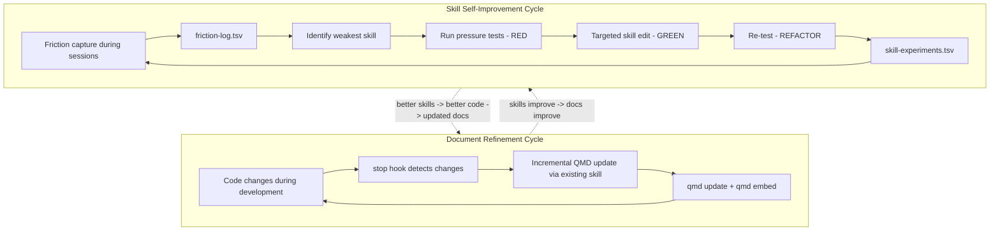
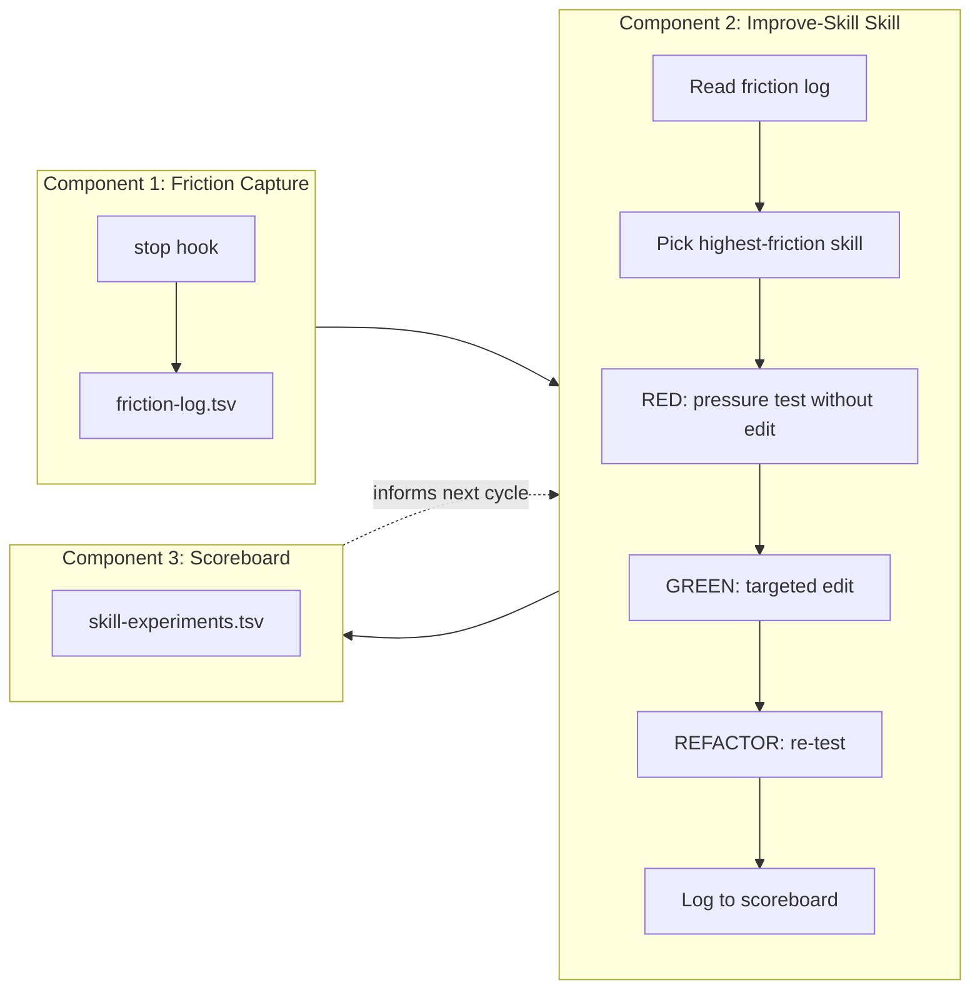
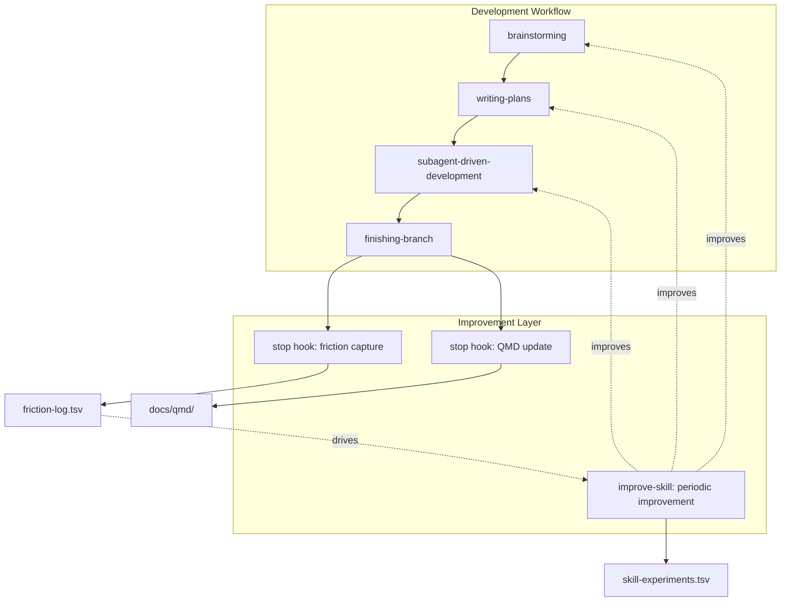

# Self-Improving Skills and Document Refinement Lifecycle

## System Overview

Two interrelated improvement loops, each borrowing from autoresearch's core pattern: **humans define intent, agents run experiments, a metric decides what stays.**



---

## Part 1: Document Refinement Cycle

### Problem

QMD docs go stale the moment code changes. The existing `document-codebase-for-qmd` skill has an incremental update mode ([`~/.cursor/skills/document-codebase-for-qmd/SKILL.md`](~/.cursor/skills/document-codebase-for-qmd/SKILL.md) lines 237-246) but requires manual invocation.

### Design: `stop` Prompt Hook

A lightweight `stop` hook that fires after every agent session. It checks whether source code was modified and whether `docs/qmd/` exists, then triggers the existing skill's incremental update mode.

**Hook location**: Project-level `.cursor/hooks.json` (so each project can opt in)

**Hook definition**:

```json
{
  "version": 1,
  "hooks": {
    "stop": [
      {
        "type": "prompt",
        "prompt": "Check if this session modified any source code files (not files under docs/). If source code changed AND a docs/qmd/ directory exists in the project root, invoke the document-codebase-for-qmd skill to run an incremental update on the affected domain documents. If no source code changed or docs/qmd/ doesn't exist, do nothing and end.",
        "timeout": 60
      }
    ]
  }
}
```

**Why a prompt hook instead of a command hook**: The incremental update requires judgment -- understanding which domains are affected, what business rules changed, whether cross-references need updating. A prompt hook delegates this to the agent, which can invoke the full skill. A command hook would need to replicate that intelligence in a script.

**Cost control**: The prompt includes "do nothing and end" for sessions that don't touch code. For sessions that do touch code, the update is targeted (only affected domains), which keeps token usage proportional to the change size.

**Alternative**: For projects where the overhead is unacceptable (very frequent small changes), a variant that only fires when the session included a git commit:

```json
{
  "type": "prompt",
  "prompt": "Check if this session created any git commits that modified source files. If yes AND docs/qmd/ exists, invoke document-codebase-for-qmd for incremental update. Otherwise do nothing.",
  "timeout": 60
}
```

---

## Part 2: Skill Self-Improvement Lifecycle

### The Autoresearch Analogy

| Autoresearch | Skill Improvement |
|---|---|
| `train.py` -- single mutable file | `SKILL.md` -- single mutable skill |
| `program.md` -- agent instructions | `improve-skill` skill -- improvement methodology |
| `val_bpb` -- validation metric | Friction count + subagent compliance rate |
| `results.tsv` -- experiment log | `skill-experiments.tsv` -- improvement scoreboard |
| Experiment loop (try/measure/keep/discard) | RED-GREEN-REFACTOR with friction data |
| Git branch advances on improvement | Git commit on passing test, revert on failure |
| Simplicity criterion (shorter is better) | Token efficiency (fewer words, same compliance) |
| `NEVER STOP` autonomous loop | `loop_limit` on `stop` hook or manual kick-off |

### Architecture: Three Components

The system has three components that form a feedback loop:



---

### Component 1: Friction Capture (Hook)

**What it captures**: Moments where the user had to correct, repeat, or override the agent -- these are signals that a skill is incomplete, unclear, or missing.

**Implementation: `stop` prompt hook**

```json
{
  "version": 1,
  "hooks": {
    "stop": [
      {
        "type": "prompt",
        "prompt": "Review this session for friction signals: (1) Did the user correct, repeat, or override any agent behavior? (2) Did the agent struggle with or misapply any skill? (3) Did the user provide instructions that should have been in a skill but weren't? If any friction was detected, append a row to ~/.cursor/skill-improvement/friction-log.tsv with columns: date, project, skill_involved (or 'none'), friction_type (correction|repetition|override|missing_skill|misapplication), description (one sentence). If no friction detected, do nothing.",
        "timeout": 30
      }
    ]
  }
}
```

**File**: `~/.cursor/skill-improvement/friction-log.tsv` (user-level, persists across projects)

**Schema**:

```
date	project	skill_involved	friction_type	description
2026-04-10	my-app	brainstorming	repetition	user said skip visual companion 3 times before agent complied
2026-04-10	my-app	tdd	override	agent wrote implementation before test despite TDD skill
2026-04-11	api-service	none	missing_skill	user had to explain database migration pattern repeatedly
```

**Friction types** (from most to least severe):
- `override` -- user explicitly overrode agent behavior (skill failed to constrain)
- `misapplication` -- agent invoked a skill but applied it incorrectly
- `repetition` -- user had to say the same thing multiple times
- `correction` -- user corrected an agent mistake (skill gap)
- `missing_skill` -- pattern emerged that should be a skill but isn't

**Why TSV**: Same format as autoresearch's `results.tsv`. Simple, appendable, readable by both humans and agents, easy to grep/sort.

---

### Component 2: The `improve-skill` Skill

This is the `program.md` equivalent -- it tells the agent HOW to run the improvement loop.

**Location**: `~/.cursor/skills/improve-skill/SKILL.md` (personal skill, works across projects)

**Core loop** (modeled on autoresearch's experiment loop):

```
LOOP:
1. Read ~/.cursor/skill-improvement/friction-log.tsv
2. Aggregate: which skill has the most friction entries since last improvement?
3. Read that skill's SKILL.md
4. Read the specific friction entries to understand WHAT failed
5. Design 1-2 pressure scenarios targeting those specific failures
6. RED: Run pressure test WITHOUT any edit (baseline - capture current behavior)
7. GREEN: Make a targeted edit to the SKILL.md addressing the friction
8. VERIFY GREEN: Run same pressure test WITH the edit
9. If compliance improved: git commit the skill edit
10. If compliance same or worse: git revert, try different approach
11. Log result to ~/.cursor/skill-improvement/skill-experiments.tsv
12. REFACTOR: If new rationalizations found, close loopholes and re-test
```

**Key design decisions**:

- **Friction-driven, not speculative**: Unlike the `writing-skills` TDD process which starts from hypothetical pressure scenarios, this loop starts from **real friction data**. The friction log tells you exactly what to fix.
- **Single-edit experiments**: Following autoresearch's pattern, each iteration makes ONE change and tests it. No batched multi-section rewrites.
- **Simplicity criterion**: If the skill can be shortened while maintaining compliance, that counts as an improvement. Track word count alongside compliance.
- **Git as memory**: Like autoresearch advancing the branch, each passing improvement gets committed. Failed experiments get reverted. The skill's git log becomes its experiment history.

**The skill composes with existing skills**:
- Uses `writing-skills` methodology for the actual RED-GREEN-REFACTOR testing
- Uses `testing-skills-with-subagents` for pressure scenario design
- Uses `verification-before-completion` before claiming an improvement

---

### Component 3: The Scoreboard

**File**: `~/.cursor/skill-improvement/skill-experiments.tsv`

**Schema** (modeled on autoresearch's `results.tsv`):

```
date	skill	commit	word_count	compliance	status	description
2026-04-10	tdd	a1b2c3d	487	pass	keep	added explicit counter for "spirit vs letter" rationalization
2026-04-10	tdd	b2c3d4e	495	pass	keep	added sunk-cost pressure to rationalization table
2026-04-11	brainstorming	c3d4e5f	312	fail	discard	removed visual companion section - agent skipped design step
2026-04-11	brainstorming	d4e5f6g	320	pass	keep	made visual companion optional with clearer skip path
```

**Columns**:
- `date` -- when the experiment ran
- `skill` -- which skill was modified
- `commit` -- short git hash (for revert if needed)
- `word_count` -- tracks simplicity over time (lower is better, all else equal)
- `compliance` -- pass/fail under pressure test
- `status` -- keep/discard/crash (same as autoresearch)
- `description` -- what was tried

**Derived metrics** (for periodic review):
- Friction entries per skill per week (trending down = improving)
- Word count over time per skill (trending down with same compliance = good)
- Keep/discard ratio (high keep rate = good experiment design)
- Time since last improvement per skill (staleness indicator)

---

## Part 3: Integration with Development Workflow

### How It All Connects

The existing superpowers workflow is: **brainstorming -> writing-plans -> subagent-driven-development -> finishing-branch**

The self-improvement system wraps around this:



### Trigger Points

| When | What Happens | Component |
|---|---|---|
| Every session ends | Friction captured, QMD docs updated | Hooks (automatic) |
| You notice recurring friction | Invoke `improve-skill` skill manually | Skill (manual) |
| Weekly review | Read scoreboard + friction log, prioritize | Human judgment |
| New skill needed | Friction log shows `missing_skill` pattern | Feeds into `create-skill` + `writing-skills` |

### The Autonomous Loop (Optional, Advanced)

For high-value skills, you can run the improvement loop autonomously -- like leaving autoresearch running overnight:

1. Kick off a session: "Improve the brainstorming skill based on recent friction"
2. The agent reads friction log, designs tests, runs RED-GREEN-REFACTOR
3. Each iteration: edit -> test -> keep/discard -> log -> next iteration
4. You review the scoreboard when done

This uses a `stop` hook with `loop_limit` to chain iterations, or simply a long-running agent session with explicit "keep going" instructions (like autoresearch's `NEVER STOP` directive).

**Constraint**: Each pressure test costs tokens (subagent invocation). Budget ~3-5 iterations per improvement session for a reasonable cost/value ratio.

---

## Part 4: Key Principles Borrowed from Autoresearch

### 1. The Metric Decides What Stays
Not intuition, not "it looks better." Friction count goes down or it doesn't. Compliance passes or it doesn't. The scoreboard is the source of truth.

### 2. Single Artifact, Single Change
Autoresearch modifies only `train.py`, one change per experiment. The skill improvement loop modifies only one SKILL.md, one section per experiment. This makes keep/discard decisions clean.

### 3. Simplicity Criterion
From autoresearch's `program.md`: "A small improvement that adds ugly complexity is not worth it. Removing something and getting equal or better results is a great outcome." Applied to skills: if you can delete a section and compliance holds, that is an improvement (fewer tokens, faster loading).

### 4. The Scoreboard is Non-Negotiable
Autoresearch logs every experiment to `results.tsv`, even crashes and discards. The skill scoreboard does the same. Without the log, you lose institutional memory across sessions.

### 5. Human Writes Intent, Agent Runs Experiments
The `improve-skill` skill is your `program.md`. You write what "good" looks like (skill compliance criteria). The agent runs the experiments (pressure tests, edits, re-tests). You review the results (scoreboard).

### 6. Cumulative Advancement
Like autoresearch advancing the git branch on success and reverting on failure, each skill improvement builds on the last. The skill's git history is its experiment history.

---

## Part 5: Implementation Plan

### File Structure

```
~/.cursor/
  hooks.json                          # User-level hooks (friction capture)
  skill-improvement/
    friction-log.tsv                  # Raw friction data from sessions
    skill-experiments.tsv             # Scoreboard of improvement experiments
  skills/
    improve-skill/
      SKILL.md                        # The meta-skill (program.md equivalent)
    document-codebase-for-qmd/        # (existing)
      SKILL.md
      doc-templates.md

{project}/.cursor/
  hooks.json                          # Project-level hooks (QMD doc updates)
```

### Implementation Order

**Phase 1: Friction Capture** -- The foundation. Without friction data, the rest is speculative. Create the user-level `stop` hook and the `friction-log.tsv` file format. Let it run for 1-2 weeks to accumulate data.

**Phase 2: QMD Doc Hook** -- Add the project-level `stop` hook for incremental QMD updates. This is independent of the skill improvement loop and immediately useful.

**Phase 3: Scoreboard** -- Create the `skill-experiments.tsv` format and seed it with any past skill improvement data you have.

**Phase 4: `improve-skill` Skill** -- Write the meta-skill that reads friction data and runs the improvement loop. This composes with existing `writing-skills` and `testing-skills-with-subagents` methodology.

**Phase 5: Autonomous Loop (Optional)** -- Add `loop_limit` support or explicit looping instructions for running multi-iteration improvement sessions.

### Testing the System

Each component should be tested before deployment:

- **Friction hook**: Deliberately create friction in a session (repeat an instruction, correct the agent), verify it appears in the log
- **QMD hook**: Modify a source file, verify the hook triggers incremental update
- **Improve-skill**: Pick a skill with known friction, run one iteration, verify the scoreboard entry and git commit
- **End-to-end**: Run a normal development session, verify friction captured, then run improve-skill against the captured friction
